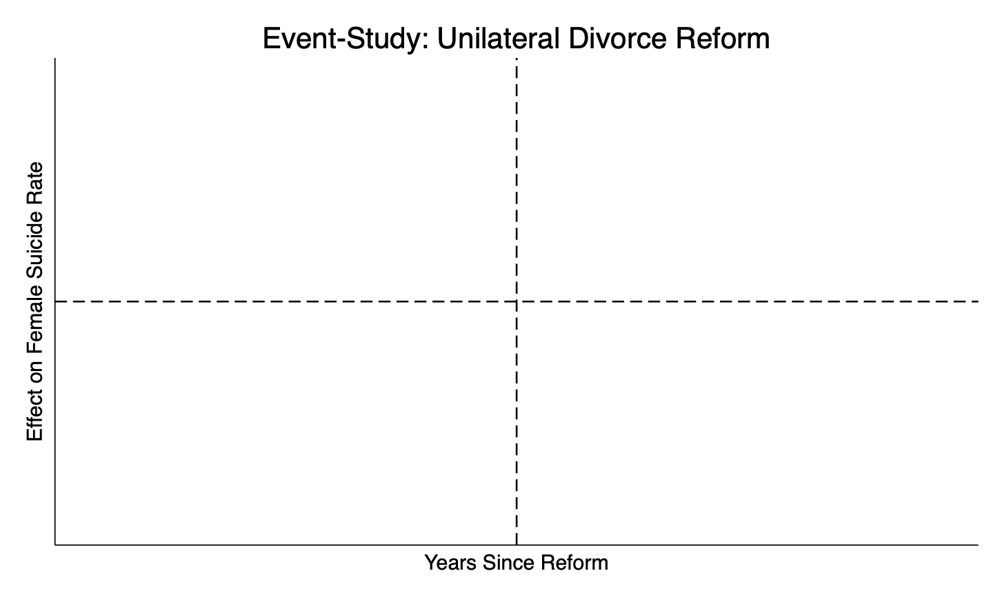

# 📚 Divorce Reform and Female Suicide – TWFE Replication

This project replicates and extends Stevenson & Wolfers (2006), analyzing the impact of no-fault (unilateral) divorce law reforms on female suicide rates across U.S. states.

---

## 🔍 Overview

- **Method**: Two-Way Fixed Effects (TWFE) DiD  
- **Data**: Panel data on suicide rates (1964–1996) across U.S. states  
- **Treatment**: Reform adoption (post-law dummy)  
- **Outcome**: Female suicide rate (`asmrs`)

---

## 📁 Repository Contents

- `code/` – Stata code for baseline and subgroup regressions  
- `data/` – Panel dataset on state-year suicide rates and reform status  
- `output/` – Regression results, plots, and summaries  
- `docs/` – Final replication report (written analysis)

---

## 📊 Sample Result

asmrs = -3.08 * treat
Standard Error = 2.456 (N=1617)

## 🔬 Heterogeneity Findings

| Group | Effect | p-value |
|-------|--------|---------|
| High Income | -5.87 | 0.011 |
| Medium Income | -11.20 | 0.000 |
| Low Income | +5.32 | 0.000 |

👉 Reform helped **most** in medium-income states; worsened outcomes in low-income states.

---

## 📈 Event Study (Placeholder)

---

## ✍️ Author

Berken Arslan  
MSc Economics & Data Science  
[github.com/berkenarslan](https://github.com/berkenarslan)

